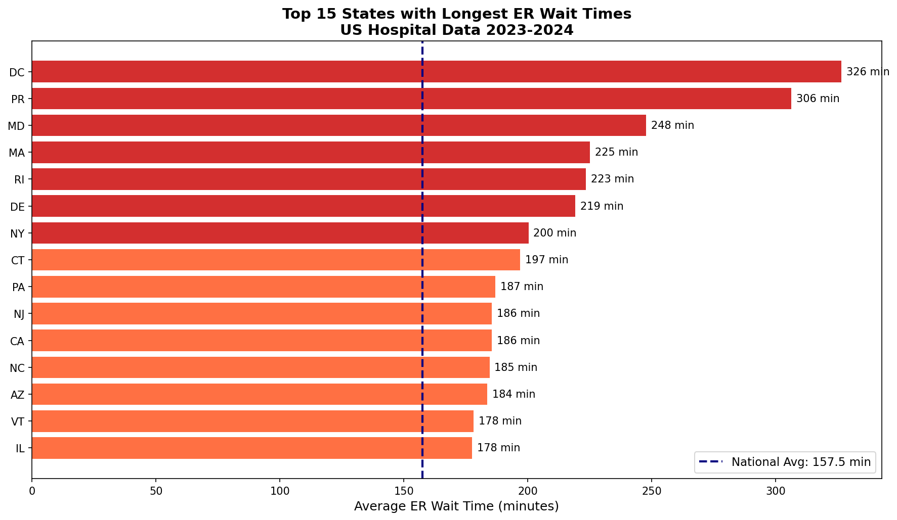
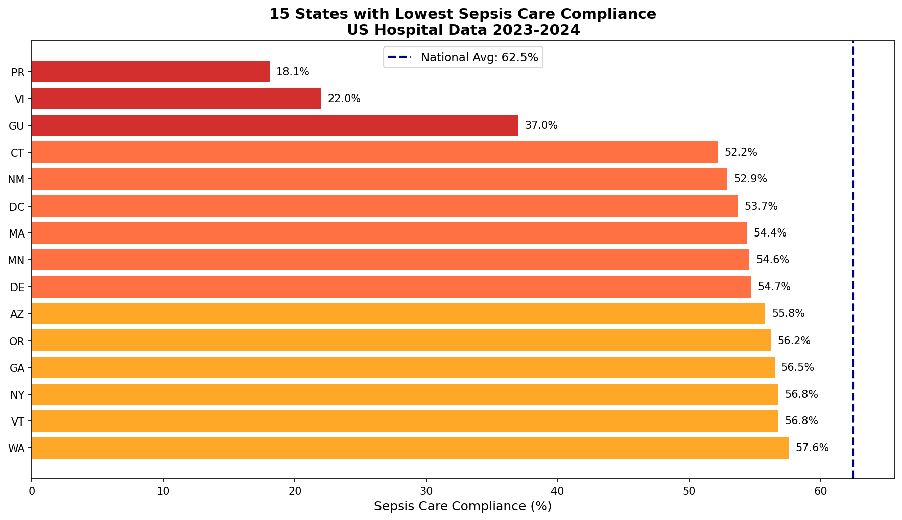
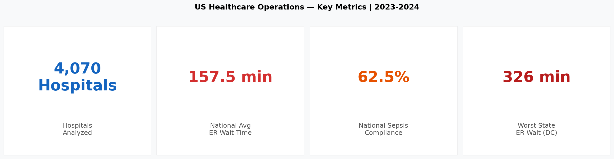

# 🏥 US Healthcare Operations Tracker

**Analyzing Emergency Department performance and Sepsis Care compliance across 4,070 US hospitals using real CMS government data.**

---

## 📊 Key Findings

| Metric | Value |
|--------|-------|
| Hospitals Analyzed | 4,070 |
| National Avg ER Wait Time | 157.5 minutes |
| National Sepsis Care Compliance | 62.5% |
| Worst State for ER Wait (DC) | 326 minutes |
| Best State for ER Wait (SD) | 114 minutes |

---

## 🚨 Why This Matters

The average American waits **2 hours 37 minutes** in the ER.
In DC, that wait is **5.4 hours.**

Only **62.5% of sepsis patients** nationwide receive all 
the right treatments on time. In Puerto Rico, that number 
drops to **18.1%** — meaning 4 out of 5 sepsis patients 
don't get proper care.

This project turns 138,000+ rows of raw government data 
into actionable operational insights for healthcare administrators.

---

## 📁 Project Structure

healthcare-operations-tracker/
├── healthcare_operations_tracker.ipynb  # Full analysis notebook
├── healthcare_clean.csv                 # Cleaned dataset (32,636 records)
├── state_er_wait.csv                    # ER wait times by state
├── state_sepsis.csv                     # Sepsis compliance by state
├── hospital_er_detail.csv               # Hospital-level detail
├── chart_er_wait.png                    # ER wait times visualization
├── chart_sepsis.png                     # Sepsis compliance visualization
└── chart_kpi.png                        # KPI summary dashboard

---

## 🛠️ Tools & Technologies

- **Python** — Pandas, NumPy, Matplotlib, Seaborn
- **Data Source** — CMS Hospital Compare (data.cms.gov)
- **Dataset Size** — 138,129 rows → cleaned to 32,636 usable records

---

## 📈 Visualizations

### ER Wait Times by State

### Sepsis Care Compliance by State

### Key Metrics Dashboard

---

## 🔍 Methodology

1. **Data Collection** — Downloaded raw CMS hospital performance data
2. **Exploration** — Identified 6 condition categories across 138K rows
3. **Cleaning** — Converted mixed text/numeric scores, handled missing values
4. **Analysis** — Filtered to ED & Sepsis metrics, aggregated by state
5. **Visualization** — Built publication-ready charts with Python

---

## 👩‍💻 Author

**Alokya Upadhaya** — Business & Data Analyst  
[LinkedIn](https://www.linkedin.com/in/alokya-upadhaya) | 
Targeting Healthcare & Finance Analytics roles in NYC
